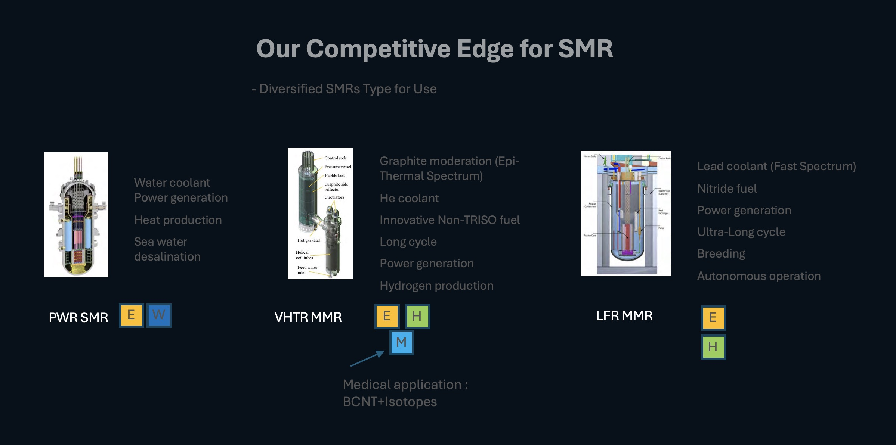

<!DOCTYPE html>
<html lang="en">
<head>
<meta charset="UTF-8">
<meta name="viewport" content="width=device-width, initial-scale=1.0">
<meta name="description" content="OnSMR leads the innovative implementation of Small Modular Reactors (SMRs) with AI technology to drive Canada's clean energy growth and achieve net zero emissions.">
<meta name="keywords" content="OnSMR, SMR, AI Technology, Clean Energy, Canada, Net Zero, Greenhouse Gas Reduction, Sustainable Energy">
<meta name="author" content="OnSMR">
<link rel="icon" href="favicon.ico" type="image/x-icon"> <!-- Add a favicon if available -->

</head>
<body>

<header class="navbar">
  
<h1>OnSMR</h1>

  <nav>
    <ul>
      <li><a href="#about">About</a></li>
      <li><a href="#technology">Technology</a></li>
      <li><a href="#implementation">Projects</a></li>
      <li><a href="#news">News</a></li>
      <li><a href="#contact">Contact</a></li>
    </ul>
  </nav>
</header>

<section class="hero">
  <h1>Innovative SMR Implementation in Canada with AI</h1>
  
Leading the way in sustainable and safe energy solutions.

  <!-- <button>Learn More</button> -->
</section>

<section id="about" class="section">
  

  <h2>About OnSMR</h2>
  
OnSMR is dedicated to revolutionizing the energy sector through the use of Small Modular Reactors powered by advanced AI technology.

  

    <h2>Net Zero Accelerator Initiative</h2>
    
<strong>Goal:</strong> To help transform the economy for clean and long term growth.

    
<strong>How?:</strong> This initiative will provide up to $8 billion in support of projects that will enable Canada to reduce its domestic greenhouse gas emissions.

    <ul>
      <li>
        <strong>Decarbonisation of large emitters:</strong>
        <ul>
          <li>the adoption of clean technology and processes that will dramatically reduce the GHG footprint of these industries by 2030, and create a pathway to net zero by 2050.</li>
        </ul>
      </li>
      <li>
        <strong>Clean technology and Industrial transformation:</strong>
        <ul>
          <li>supporting the green transformation of key industrial sectors, such as automotive, aerospace, agriculture and agri-food.</li>
        </ul>
      </li>
      <li>
        <strong>Development of a Canadian batteries ecosystem:</strong>
        <ul>
          <li>Having a positive impact on the creation of a domestic battery supply chain.</li>
        </ul>
      </li>
    </ul>
  

</section>

<section id="technology" class="section">
  

  <h2>Technology</h2>
  
Our state-of-the-art SMR technology integrates AI to optimize energy production, reduce waste, and ensure safety.

  
</section>

<section id="implementation" class="section">
  

  <h2>Current Projects in Canada</h2>
  

    <!-- Implementation case studies will go here -->
    <table>
        <tr>
          <th>Project</th>
          <th>Reactor Type</th>
          <th>Status</th>
        </tr>
        <tr>
          <td>OPG Darlington New Nuclear</td>
          <td>4 BWRX-300 SMRs</td>
          <td>Preparing site, has applied for construction license</td>
        </tr>
        <tr>
          <td>Chalk River National Lab</td>
          <td>Global First Power MNR high temperature gas micro reactor</td>
          <td>Applied for License to prepare site, undergoing EA</td>
        </tr>
        <tr>
          <td>Point Lepreau New Brunswick</td>
          <td>NB Power ARC-100</td>
          <td>Applied for License to prepare site, undergoing Provincial EIA</td>
        </tr>
    </table>
  

</section>

<section id="news" class="section">
  

  <h2>News and Insights</h2>
  

    <!-- News articles and updates will go here -->
  

</section>

<section class="section">
  
</section>

<section id="contact" class="section">
  <h2>Contact Us</h2>
  
Reach out to learn more about our technology and how we can help you transition to sustainable energy.

  <!-- Contact form will go here -->
  <!-- Enhanced Contact Us Section -->
  <section class="contact-section">
    

      <a href="mailto:hi@onsmr.com">
          <!-- Replace with your email icon path -->
        hi@onsmr.com
      </a>
    

  </section>
</section>

<footer class="footer">
  
&copy; 2024 OnSMR - All rights reserved.

</footer>

</body>
</html>
